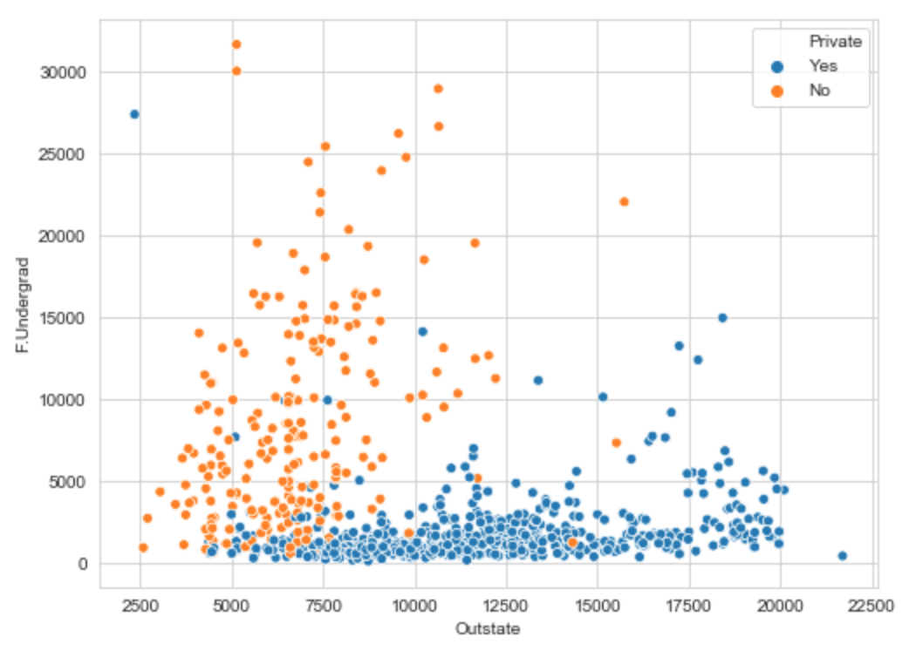

## Portfolio

---

[K Means Clustering of University Data](https://medium.com/@chriswoodard43/k-means-clustering-of-university-data-9e8491068778)
  
For this project, I use K-means clustering, a common unsupervised machine learning model, on a universities dataset to predict whether a model can correcly cluster public and private schools.

---
[Visualizing COVID-19 Spread with Tableau Animations](https://medium.com/@chriswoodard43/visualizing-covid-19-spread-with-tableau-animations-75890dda23bb)
  
[Tableau Public](https://public.tableau.com/profile/christopher.woodard4874#!/vizhome/COVIDbyCountyAMosaic/COVIDbyCountyAMosaic)
  

This project arose out of an interest to visualize how COVID-19 hotspots have shifted over the course of the unfolding pandemic. Ever since watching [this video]( https://www.youtube.com/watch?v=8WVoJ6JNLO8), I've been interested in time-based animations like the "racing bar chart"  shown in the video. Since COVID outbreaks are highly linked with geography, I'm going to attempt to recreate an animated map version and some racing bar charts to see what we can learn.

---

Page template forked from <a href="https://github.com/evanca/quick-portfolio">evanca</a>

<!-- Remove above link if you don't want to attibute -->
